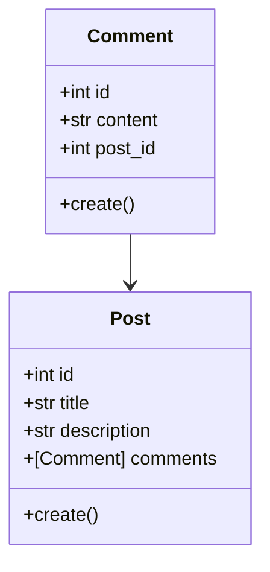

# **Tangled**

## **Intros**

Halo semua! Perkenalkan saya Ghozy, pada kesempatan kali ini saya ingin berbagi tentang sebuah apps sederhana bernama **Tangled**. **Tangled** berdasarkan bahasa Inggris berarti **kusut**, sedangkan **Tangle(t)** dalam bahasa Jawa memiliki arti **tanya** sehingga aplikasi **Tangled** diharapkan dapat menjadi sebuah aplikasi untuk bertanya ketika kalian sudah merasa kusut terutama karena kerjain sebuah kodingan maupun design 🤪.

Aplikasi **Tangled** untuk saat ini masih berjalan pada platform iOS dan telah terintegrasi dengan ***microservices***. Pada percobaan kali ini, saya menggunakan arsitektur DDD (*Domain-Drive Design*) pada ***backend service*** untuk mengatur data **post** dan **comment** yang telah dikirim/diminta oleh **Tangled** serta memanfaatkan **mailer service** untuk pengiriman *e-mail* kepada *user*.

## **Let's having fun with Golang (Go Language)**

Oke, sebelum kita mulai lebih lanjut tentang gimana saya bikin *microservices* dengan Go, mari kita bahas dulu kenapa harus dengan Go?

Pertama kalinya saya menggunakan Go itu sejak 2020 dan hal tersebut menjadi pengalaman baru bagi saya yang terbiasa menggunakan Python sebagai bahasa utama dalam mengerjakan tugas akhir kala itu. Sebagai bahasa yang katanya menjadi penyempurna dari bahasa C/C++, kini Go sangat terkenal dan banyak digunakan oleh perusahaan baik *Start-up* maupun BUMN. Salah satu alasan mengapa Go menjadi terkenal karena kecepatannya dalam bekerja. Go merupakan *statically-typed language* yang berarti Go tidak memerlukan proses lebih untuk mentranslasi *code* yang ada layaknya *dynamically-typed language*, serta dikombinasikannya dengan fitur *concurrency* yang dapat mengoptimalkan jumlah *core* yang dimiliki sehingga dapat mempercepat Go dalam memproses suatu *task*.

Untuk lebih lanjut dalam mengenal Go, kalian bisa melakukan *research* tersendiri yaa terkait Go!

## **Microservices**

Ketika kita membahas tentang *microservices* berarti kita akan membagi suatu *service* menjadi lebih kecil dan saling terhubung satu antar lainnya. Pada kesempatan ini saya membuat dua *services* sederhana yaitu *backend service* dan *mailer service*.

### **Backend service**

Pada bagian ini saya ingin sedikit menjelaskan tentang bagaimana DDD dapat bekerja pada Go (tentu *code* ini masih jauh dari kata sempurna, jadi mohon pengertiannya yaa). Sebelumnya saya sangat merekomendasikan kalian untuk membaca buku *Architecture Patterns with Python* yang ditulis oleh Harry J.W. Percival & Bob Gregory, meski buku tersebut memberikan contoh konsep DDD pada bahasa Python tapi konsep yang diterapkan cukup identik dengan yang saya terapkan pada Go kali ini.

Kita akan memulai dengan pembahasan **Domain Model**. Bagi teman-teman di Apple Developer Academy mungkin sudah tidak asing dengan kata *Domain Investigate* dan *General Investigate*. *Domain* dapat kita artikan secara sederhana sebagai hal/masalah yang ingin kita selesaikan. Pada kasus ini masalah yang akan kita selesaikan adalah bagaimana seorang *user* dapat bertanya maupun menjawab pertanyaan secara tak dikenal. Maka kali ini kita akan memiliki 2 entitas diantaranya Post dan Comment seperti ilustrasi dibawah ini.

### **Domain Model**



Setelah kita membuat *Domain Model*, kita akan sedikit membahas tentang *repository pattern*. *Repository* adalah sebuah *layer* yang bekerja tepat sebelum *database layer*, dimana *repository pattern* merupakan bentuk abstraksi terhadap penyimpanan yang persisten sehingga kita dapat mengatur kapan dan bagaimana kita menyimpan data pada memori maupun pada *database*.

Catatan: Sebenarnya untuk sebuah *service* yang hanya membuat CRUD sederhana seperti ini kita tidak perlu menggunakan konsep *Domain Model* dan *repository pattern* karena akan membutuhkan usaha yang lebih dibandingkan dengan penggunaan ORM/*ActiveRecord pattern*. ***Penerapan ini hanya sebagai bentuk pembelajaran semata.***

Berikut merupakan potongan *code* dari salah satu fungsi untuk menyimpan data *comment* dari *comment repository*.

```go
// backend/adapters/comment_repository.go
func (r *CommentRepo) SaveComment(comment *domain.Comment) (*domain.Comment, map[string]string) {
 dbErr := map[string]string{}

 err := r.db.Debug().Create(&comment).Error
 if err != nil {
  //any other db error
  dbErr["db_error"] = "database error"
  return nil, dbErr
 }
 return comment, nil
}
```

Setelah kita menentukan *Domain Model* dan membuat *repository*, maka langkah terakhir yang diperlukan adalah dengan membuat *handler* yang akan mengatur bagaimana *request* yang masuk diatur oleh sistem. Saya menggunakan *framework* [Gin](https://gin-gonic.com/) sebagai *middleware* untuk menerima data maupun *routing* suatu *endpoint*.

Berikut merupakan potongan *code* dari salah satu *routes* untuk menyimpan suatu komentar serta fungsi untuk mengatur logika penyimpanan suatu komentar.

```go
// backend/handlers/handler.go
s.Router.POST("/comment", s.Handler.SaveComment)

// backend/handlers/comment_handler.go
func (handler *Handler) SaveComment(c *gin.Context) {
 var comment = domain.Comment{}
 if err := c.ShouldBindJSON(&comment); err != nil {
  c.JSON(http.StatusUnprocessableEntity, err.Error())
  return
 }

 ngen := namegen.New()
 creator := ngen.Get()

 comment.Creator = creator

 savedComment, saveErr := handler.CommentApp.SaveComment(&comment)
 if saveErr != nil {
  c.JSON(http.StatusInternalServerError, saveErr)
  return
 }
 c.JSON(http.StatusCreated, savedComment)
}
```

### **Mailer Service**

Ketika kita berbicara tentang *microservices*, maka sudah pasti adanya lebih dari satu *service* yang bekerja. Pada percobaan kali ini saya memadukan *backend service* dengan *mailer service* yang bertugas untuk mengirimkan *e-mail* setiap kali dipantik oleh *backend service*.

*Mailer service* bekerja dengan memanfaatkan [gomail.v2](gopkg.in/gomail.v2) sebagai *framework mailer*. Dalam menghubungkan antara *backend service* dengan *mailer service*, saya memanfaatkan *framework* [asynq](github.com/hibiken/asynq) yang bekerja dibawah *redis*.

Berikut merupakan potongan *code* dari fungsi untuk mengurus *request* pengiriman *e-mail* dari *mailer service* dan bagaimana cara *backend service* mengirimkan *request* pengiriman *e-mail* terhadap *mailer service*.

```go
// backend/handlers/user_handler.go
func (handler *Handler) SaveUser(c *gin.Context) {
 var user domain.User{}
 if err := c.ShouldBindJSON(&comment); err != nil {
  c.JSON(http.StatusUnprocessableEntity, err.Error())
  return
 }
 
 newUser, err := handler.userApp.SaveUser(&user)
 if err != nil {
  c.JSON(http.StatusInternalServerError, err)
  return
 }

 // Sending email everytime we create a new User
 errSendMail := handler.wk.SendEmail(&worker.Payload{UserName: newUser.FullName(), TemplateName: "welcome.html", To: newUser.Email})
 if errSendMail != nil {
  c.JSON(http.StatusInternalServerError, errSendMail)
 }
 c.JSON(http.StatusCreated, newUser.PublicUser())
}

// mailer/tasks/handlres.go
func HandleEmailTask(c context.Context, t *asynq.Task) error {
 // Get user ID from given task.
 var data map[string]interface{}
 if err := json.Unmarshal(t.Payload(), &data); err != nil {
  return err
 }

 templateData := Payload{
  UserName: data["UserName"].(string),
 }
 to := data["To"].(string)
 fmt.Printf("Sending Email to %s\n", data["UserName"].(string))
 go SendEmailTask(to, data["TemplateName"].(string), templateData)

 return nil
}
```

Ooops! Sepertinya sampai sini dulu pembahasan kita terkait pengembangan *microservices* dengan bahasa Go, semoga kalian dapat memahami dengan mudah akan penjelasan di atas. Kedepannya artikel ini akan diperbarui kembali terkait bagaimana melakukan integrasi antara SwiftUI dengan *backend service*, *please stay in touch if you want to know more yes!* 😬

Terima kasih telah membaca~
